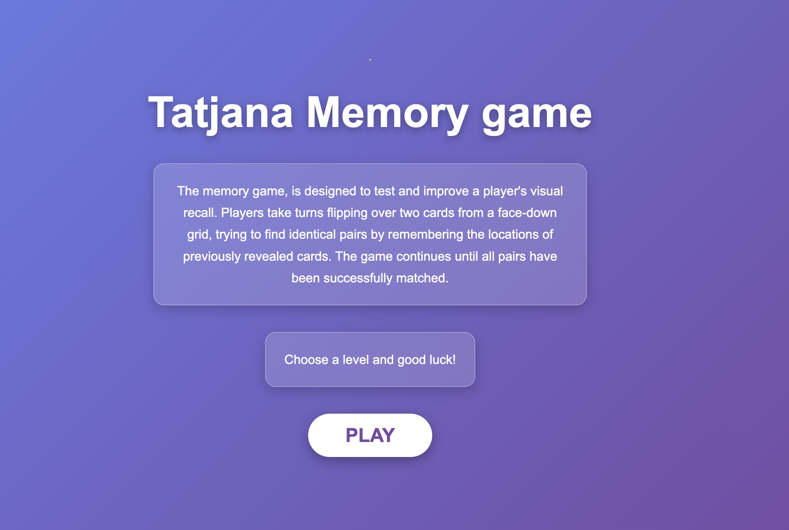
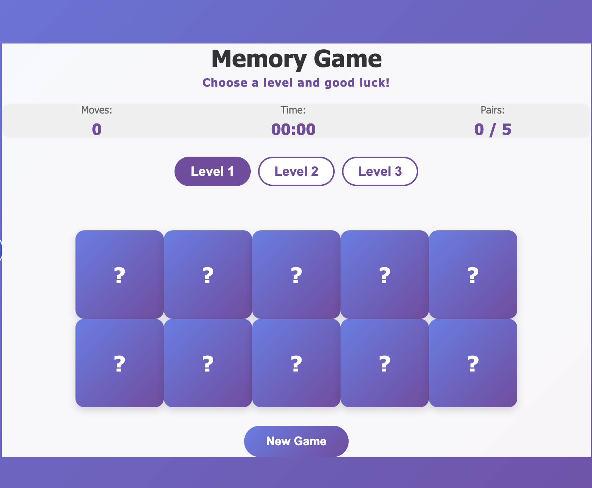
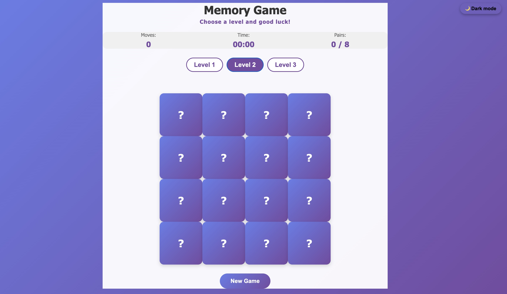
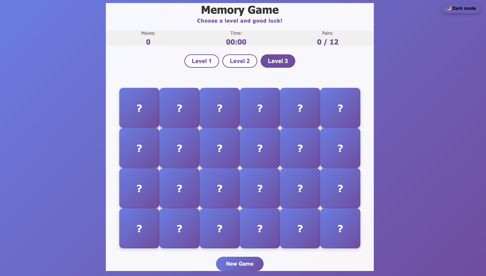
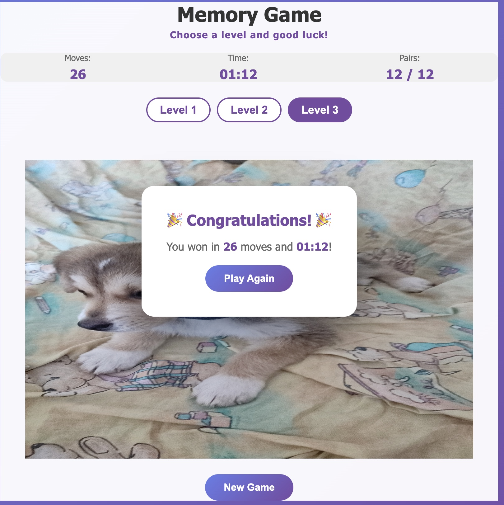
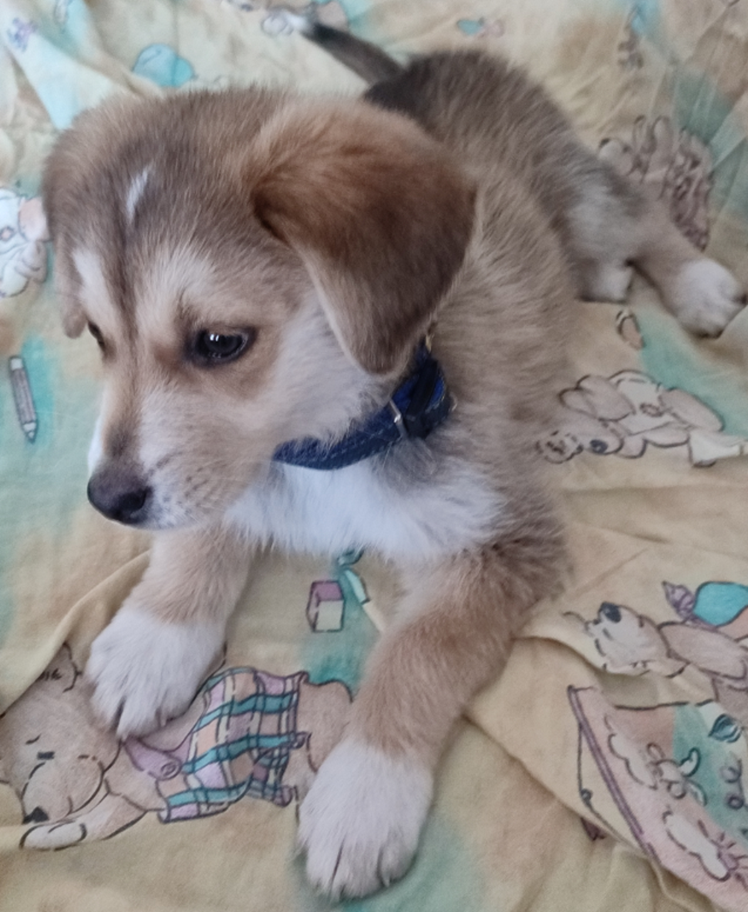

# Tatjana memory game

### By: Tatjana Markovic

#### [Portfolio](https:// ) | [GitHub](https://github.com//tatjana2020) | [LinkedIn](https://www.linkedin.com/feed/)
#### Date: 8/10/2026
***

### ***Description***
The memory game, is a card game designed to test and improve a player's visual recall. Players take turns flipping over two cards from a face-down grid, trying to find identical pairs by remembering the locations of previously revealed cards. The game continues until all pairs have been successfully matched, and the player with the most pairs at the end wins. This game was implemented using Javascript, HTML and CSS. This is the first project for Software Engineering @ General Assembly.
***

### ***Technologies Used***
* Javascript
* HTML
* CSS
* GitHub

***

### ***Getting Started***

#### 
* Read about the story.
* Once ready, click the "Play" button.
* Click on the card to start game. You must find all pairs of the same pictures.
* Win the game to see the image of Lara.
* Enjoy yourself!
***

### ***Future Updates***

- Add more levels and obstacles
- Add sound effects for various actions
- Implement more player interactivity
***

### ***Screenshots***

##### Journey homepage

##### Journey gameboard

***

### ***Credits***
#### Support and Help: 
course - Software Engineering Bootcamp - General Assembly

